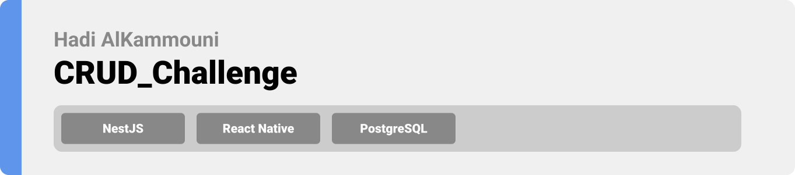

<div align="center">

> Hello world! This is the project’s summary that describes the project plain and simple, limited to the space available. 
 


**[PROJECT PHILOSOPHY](#-project-philosophy) • [TECH STACK](#-tech-stack) • [IMPLEMENTATION](#-impplementation) • [HOW TO RUN?](#-how-to-run)**
</div>

<br>


> This application is mainly based on CRUD operations.


### User Stories
- As a user, I want to create new account.
- As a user, I want to login using my personal account.
- As a user, I want to view the displayed products and their details.
- As a user, I want to add products to my cart and edit my cart if needed.

### Admin Stories
- As an admin, I want create new account.
- As an admin, I want to login using my personal account.
- As an admin, I want to fill my stock by different products.
- As an admin, I want to modify my stock.

<br>


Here's a brief high-level overview of the tech stack the app uses:

- [Nest (NestJS)](https://docs.nestjs.com/) is a framework for building efficient, scalable Node.js server-side applications. It uses progressive JavaScript, is built with and fully supports TypeScript (yet still enables developers to code in pure JavaScript) and combines elements of OOP (Object Oriented Programming), FP (Functional Programming), and FRP (Functional Reactive Programming).
- In addition to [React native framework](https://reactnative.dev/). React Native combines the best parts of native development with React. You can use React Native today in your existing Android and iOS projects or you can create a whole new app from scratch.
- [PostgreSQL](https://www.postgresql.org/docs/) is a powerful, open source object-relational database system that uses and extends the SQL language combined with many features that safely store and scale the most complicated data workloads. It was used as the db of this application.

<br>


> Using the above mentioned tech stacks, the implementation of the app is shown as below, these are screenshots from the real app.
<br>
(Please note that the following are gifs and may take few seconds to open)

### App Implementation 💻

| Register   | Login  |
| -----------------|-----|
|  |  |

| View Products & Add to Cart   | View Cart & Modify it  |
| -----------------|-----|
|  |  |

<br>


> This is an example of how you may give instructions on setting up your project locally.
To get a local copy up and running follow these simple example steps.

### Prerequisites

This is an example of how to list things you need to use the software and how to install them.
* npm
  ```sh
  npm install npm@latest -g
  ```

### Installation

_Below is an example of how you can instruct your audience on installing and setting up your app. This template doesn't rely on any external dependencies or services._

1. Clone the repo
   ```sh
   git clone https://github.com/Hadi-AlKammouni/CRUD_Challenge.git
   ```
2. Install NPM packages
   ```sh
   npm install
   ```
3. To run the react native project (make sure you have expo go app on your mobile)
   ```
   expo start
   ```
4. To run the nest js project
   ```
   nest start
   ```
5. Make sure to add your db configuration after creating .env file
   ```
   PORT=port number

   DATABASE_HOST=db host
   DATABASE_NAME=db name
   DATABASE_USER=db user
   DATABASE_PASSWORD=db password
   DATABASE_PORT=db port

   JWT_KEY=jwt key
   JWT_EXPIRES=jwt expiry
   ```   